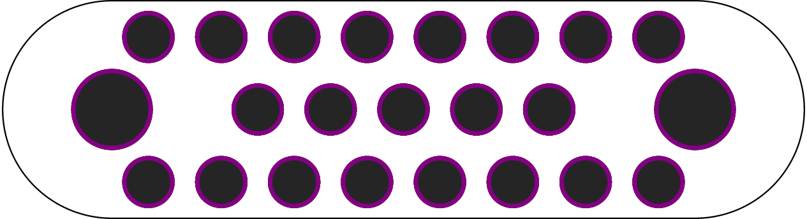

# maker-panel

[](https://crates.io/crates/maker-panel)
[](https://docs.rs/maker-panel/)


Make simple parts by combining shapes together. Order them as cheap PCBs.

[Language reference](docs/spec-reference.md)

## Examples

This (using maker-panel expressions):

```go
wrap (column center {
    [12] R<7.5>(h)
    [ 9] R<7.5>(h)
    [12] R<7.5>(h)
}) with {
  left => C<11.25>(h5),
  right => C<11.25>(h5),
}
```

Makes this:

<p align="center">
  
</p>

To generate the gerbers for you, you can run:

```shell
cargo run -- --hull -f examples/ex2.spec gen -f zip > ex2_r1.zip
```

which will give you `ex2_r1.zip` which you can upload to your fabhouse of choice.

# License

MIT License. Raster font is from http://uzebox.org/, itself licensed under [CC BY-SA 3.0](https://creativecommons.org/licenses/by-sa/3.0/).
