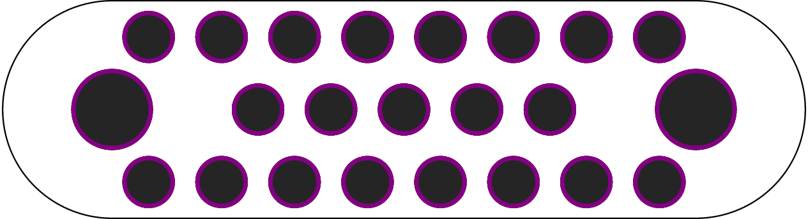
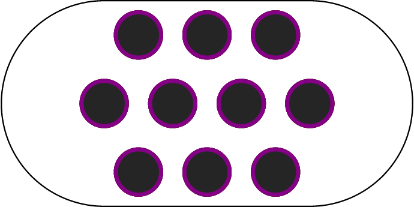

# maker-panel

[](https://crates.io/crates/maker-panel)
[](https://docs.rs/maker-panel/)


Eventually you'll be able to specify very basic geometry (ie: screw holes repeating every x mm, striding every y mm), and have usable PCBs generated.

## Examples

This (using maker-panel expressions):

```go
x_wrap(
    C<11.25>(h5),
    layout column center {
        [12] R<7.5>(h)
        [ 9] R<7.5>(h)
        [12] R<7.5>(h)
    },
    C<11.25>(h5),
)
```

Makes this:

<p align="center">
  
</p>


and this (in literal rust):

```rust
let mut panel = Panel::new();
// panel.convex_hull(true);
// panel.push(Rect::with_center([0.0, -2.5].into(), 5., 5.));
panel.push(repeating::Tile::new(
    Rect::with_inner(ScrewHole::default(), [0., 0.].into(), [5., 5.].into()),
    Direction::Right,
    3,
));
panel.push(repeating::Tile::new(
    Rect::with_inner(ScrewHole::default(), [-2.5, 5.].into(), [2.5, 10.].into()),
    Direction::Right,
    4,
));
panel.push(repeating::Tile::new(
    Rect::with_inner(ScrewHole::default(), [0., 10.].into(), [5., 15.].into()),
    Direction::Right,
    3,
));
panel.push(Circle::new([0., 7.5].into(), 7.5));
panel.push(Circle::new([15., 7.5].into(), 7.5));
```

Makes this:

<p align="center">
  
</p>
