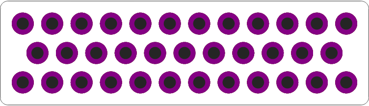

# maker-panel

[](https://crates.io/crates/maker-panel)
[](https://docs.rs/maker-panel/)


Make simple parts by combining shapes together. Order them as cheap PCBs.

[Language reference](docs/spec-reference.md)

## Examples

This (using maker-panel expressions):

```go
wrap (column center {
    [12] R<7.5>(h)
    [ 9] R<7.5>(h)
    [12] R<7.5>(h)
}) with {
  left => C<11.25>(h5),
  right => C<11.25>(h5),
}
```

Makes this:

<p align="center">
  
</p>

and this:

```go
wrap (
  column center {
    [12] R<7.5>(h)
    [11] R<7.5>(h)
    [12] R<7.5>(h)
  }
) with {
  top-0.5 => C<2>,
  top+0.5 => C<2>,
  bottom-0.5 => C<2>,
  bottom+0.5 => C<2>,
}
```

generated with

```shell
cargo run -- --hull -f examples/ex3.spec png --size z:8 examples/ex3.png
```

makes this:

<p align="center">
  
</p>


and this (in literal rust):

```rust
let mut panel = Panel::new();
// panel.convex_hull(true);
// panel.push(Rect::with_center([0.0, -2.5].into(), 5., 5.));
panel.push(repeating::Tile::new(
    Rect::with_inner(ScrewHole::default(), [0., 0.].into(), [5., 5.].into()),
    Direction::Right,
    3,
));
panel.push(repeating::Tile::new(
    Rect::with_inner(ScrewHole::default(), [-2.5, 5.].into(), [2.5, 10.].into()),
    Direction::Right,
    4,
));
panel.push(repeating::Tile::new(
    Rect::with_inner(ScrewHole::default(), [0., 10.].into(), [5., 15.].into()),
    Direction::Right,
    3,
));
panel.push(Circle::new([0., 7.5].into(), 7.5));
panel.push(Circle::new([15., 7.5].into(), 7.5));
```

Makes this:

<p align="center">
  
</p>

To generate the gerbers for you, you can run:

```shell
cargo run -- --hull -f examples/ex3.spec gen -f zip > ex1_r1.zip
```

which will give you `ex1_r1.zip` which you can upload to your fabhouse of choice.

# License

MIT License. Raster font is from http://uzebox.org/, itself licensed under [CC BY-SA 3.0](https://creativecommons.org/licenses/by-sa/3.0/).
